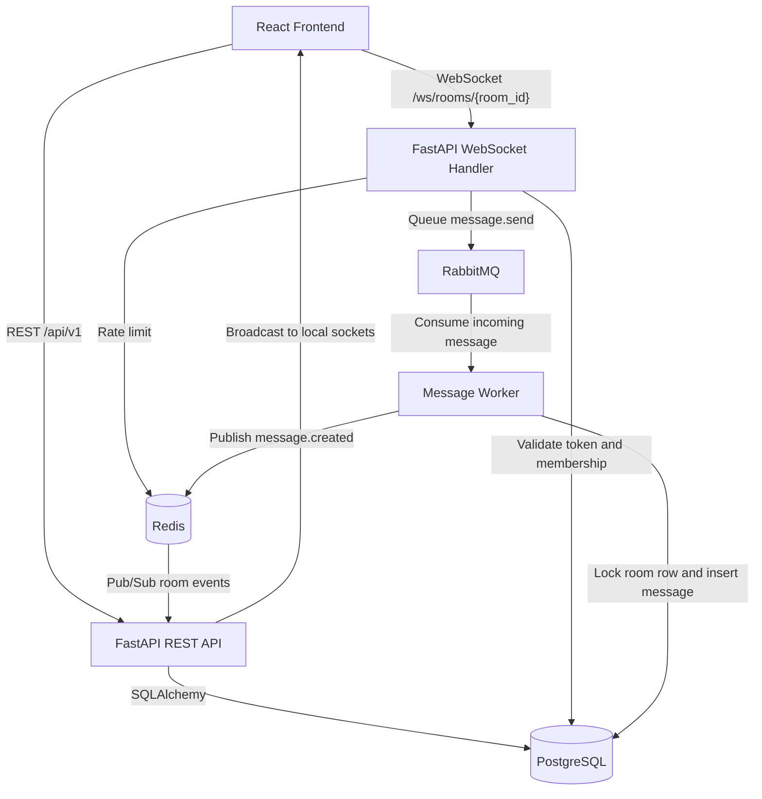

# Real-Time Chat App Documentation

Last updated: 2026-05-12

This document explains the chat app as it exists now. It is written for two audiences:

- You, as the developer learning how the system works.
- Reviewers or hiring teams who want to understand the architecture and tradeoffs.

## 1. Project Summary

The Real-Time Chat App is a portfolio-grade chat system with:

- JWT authentication
- User profiles with birthday and profile photo upload
- Public rooms
- Private 1:1 direct rooms
- Room membership checks
- Persistent ordered messages
- WebSocket real-time delivery
- RabbitMQ message queue
- Redis Pub/Sub for cross-instance sync
- Redis rate limiting
- Reconnect support using `last_sequence`
- Read receipts
- Typing indicators
- React frontend with HeroUI
- Docker Compose local stack

The main goal is to show that this is not just a CRUD app. It demonstrates backend architecture ideas used in real systems: queue-based message processing, ordered persistence, reconnect recovery, horizontal WebSocket scaling, and membership-based authorization.

## 2. Tech Stack

Backend:

- FastAPI
- sync SQLAlchemy
- Alembic
- PostgreSQL
- Redis
- RabbitMQ
- JWT with `python-jose`
- password hashing with `passlib`
- pytest

Frontend:

- React
- Vite
- HeroUI
- Tailwind CSS 4
- Playwright
- WebSocket browser API

Infrastructure:

- Docker Compose
- Nginx for the optional multi-instance demo

## 3. High-Level Architecture

The app uses REST for account, room, profile, message history, and read-state APIs. It uses WebSockets for live room events.



Simple explanation:

1. The user logs in and receives tokens.
2. The user joins or creates a room.
3. The frontend opens a WebSocket for that room.
4. When the user sends a message, the WebSocket handler does not write it directly to the database.
5. It puts the message in RabbitMQ.
6. The worker consumes the message, locks the room row, creates the next sequence number, saves the message, and publishes an event to Redis.
7. Every FastAPI instance listens to Redis and broadcasts the event to connected clients.

This design lets multiple backend instances stay synchronized.

## 4. Repository Structure

```txt
chat_system/
  backend/
    Dockerfile
    app/
      main.py
      api/
        dependencies.py
        routes/
          auth.py
          users.py
          rooms.py
          messages.py
      core/
        config.py
        security.py
        redis.py
        queue.py
      db/
        base.py
        session.py
      models/
        user.py
        room.py
        room_member.py
        message.py
        read_state.py
        websocket_session.py
      repositories/
        user_repository.py
        room_repository.py
        message_repository.py
      services/
        auth_service.py
        user_service.py
        room_service.py
        message_service.py
        message_worker_service.py
        receipt_service.py
      websocket/
        handlers.py
        manager.py
        schemas.py
      workers/
        message_worker.py
      tests/
      alembic/
  frontend/
    src/
      App.jsx
      api/
      demo/
      realtime/
      storage.js
      styles.css
    tests/
  docs/
  docker-compose.yml
  nginx.conf
  README.md
  sys_design.md
```

## 5. Backend Layer Explanation

The backend is organized into layers.

### 5.1 Routes

Routes receive HTTP requests, validate request bodies using Pydantic models, call services, and return response objects.

Important files:

- `backend/app/api/routes/auth.py`
- `backend/app/api/routes/users.py`
- `backend/app/api/routes/rooms.py`
- `backend/app/api/routes/messages.py`

Routes should stay thin. They should not contain complex business logic.

### 5.2 Services

Services contain business rules.

Examples:

- `auth_service.py` handles registration, login, password checks, and token issuing.
- `room_service.py` handles room creation, joining, membership checks, direct rooms, and rename rules.
- `message_worker_service.py` handles ordered message persistence.
- `receipt_service.py` handles read-state updates and read receipt events.
- `user_service.py` handles profile updates, username checks, search, birthday validation, and photo upload.

### 5.3 Repositories

Repositories contain database query helpers. They use sync SQLAlchemy:

- `select(...)`
- `db.execute(...)`
- `scalar_one_or_none()`
- `scalars().all()`
- `db.add(...)`
- `db.commit()`
- `db.refresh(...)`

Important files:

- `user_repository.py`
- `room_repository.py`
- `message_repository.py`

### 5.4 Models

Models define the database tables:

- `User`
- `Room`
- `RoomMember`
- `Message`
- `RoomReadState`
- `WebSocketSession`

The most important constraints are:

```txt
users.email unique
users.username unique
rooms.name unique
rooms.direct_key unique nullable
room_members unique(room_id, user_id)
messages unique(room_id, sequence_number)
messages unique(sender_id, client_message_id)
room_read_states unique(room_id, user_id)
websocket_sessions unique(user_id, room_id)
```

## 6. Database Model Explanation

### 6.1 User

Stores account and profile information.

Important fields:

- `id`
- `email`
- `username`
- `password_hash`
- `birthday`
- `profile_photo_url`
- `is_active`
- `created_at`
- `updated_at`

The app never stores raw passwords.

### 6.2 Room

Stores public rooms and private direct rooms.

Important fields:

- `id`
- `name`
- `is_direct`
- `direct_key`
- `created_by_id`
- `last_sequence_number`
- `created_at`

`last_sequence_number` is the counter used to order messages inside each room.

### 6.3 RoomMember

Connects users to rooms.

Important rule:

```txt
unique(room_id, user_id)
```

This allows one user to join many rooms, but prevents duplicate membership in the same room.

### 6.4 Message

Stores persisted chat messages.

Important fields:

- `room_id`
- `sender_id`
- `content`
- `sequence_number`
- `client_message_id`
- `created_at`

Important rules:

```txt
unique(room_id, sequence_number)
unique(sender_id, client_message_id)
```

This means:

- Room A can have sequence `1`.
- Room B can also have sequence `1`.
- The same sender cannot create duplicate messages with the same `client_message_id`.

### 6.5 RoomReadState

Stores each user's latest read sequence per room.

Instead of saving one row per read message, the app stores:

```txt
user X in room Y has read up to sequence N
```

This is more efficient.

### 6.6 WebSocketSession

Stores reconnect information:

- user
- room
- last seen time
- last received sequence

The frontend also stores last sequence locally.

## 7. Authentication Flow

### Register

Endpoint:

```txt
POST /api/v1/auth/register
```

Request:

```json
{
  "email": "ada@example.com",
  "username": "ada",
  "password": "strong-password",
  "birthday": "1995-05-07"
}
```

Response:

```json
{
  "id": "uuid",
  "email": "ada@example.com",
  "username": "ada",
  "birthday": "1995-05-07",
  "profile_photo_url": null
}
```

Rules:

- Email must be unique.
- Username must be unique.
- Password must be at least 8 characters.
- Birthday cannot be in the future.

### Login

Endpoint:

```txt
POST /api/v1/auth/login
```

Request:

```json
{
  "email": "ada@example.com",
  "password": "strong-password"
}
```

Response:

```json
{
  "access_token": "jwt",
  "refresh_token": "jwt",
  "token_type": "bearer"
}
```

### Refresh

Endpoint:

```txt
POST /api/v1/auth/refresh
```

Request:

```json
{
  "refresh_token": "jwt"
}
```

Response:

```json
{
  "access_token": "jwt",
  "token_type": "bearer"
}
```

## 8. User Profile And People Search

### Get Current User

```txt
GET /api/v1/users/me
```

Requires access token.

### Update Current User

```txt
PATCH /api/v1/users/me
```

Request:

```json
{
  "username": "ada-lovelace",
  "birthday": "1995-05-07"
}
```

### Upload Profile Photo

```txt
POST /api/v1/users/me/photo
```

Form data:

```txt
photo: image file
```

Rules:

- File must be an image.
- Allowed types: JPG, PNG, WEBP, GIF.
- Maximum size: 2 MB.
- Stored under `/uploads/profile_photos/...`.

MVP note:

Uploaded files are stored in the backend container filesystem. For production, use a Docker volume or object storage.

### Search Users

```txt
GET /api/v1/users/search?username=ada&limit=10
```

Used by the People page to find users and start direct chats.

The response hides private fields like email and birthday.

## 9. Room Flow

### Create Room

```txt
POST /api/v1/rooms
```

Request:

```json
{
  "name": "general"
}
```

When a room is created:

1. The room is inserted.
2. The creator is added as a room member.
3. The response marks `is_member: true`.

### List Rooms

```txt
GET /api/v1/rooms?limit=50&offset=0
```

Rules:

- Public rooms are visible to authenticated users.
- Direct rooms are visible only to their members.
- Each room includes whether the current user is a member.

### Join Room

```txt
POST /api/v1/rooms/{room_id}/join
```

Rules:

- Public rooms can be joined.
- Joining twice is idempotent.
- Direct rooms cannot be joined publicly.

### Room Detail

```txt
GET /api/v1/rooms/{room_id}
```

Rules:

- Requires membership.
- Returns room info and members.

### Rename Room

```txt
PATCH /api/v1/rooms/{room_id}
```

Rules:

- Only the creator can rename public rooms.
- Direct rooms cannot be renamed.

### Room Members

```txt
GET /api/v1/rooms/{room_id}/members
```

Rules:

- Requires membership.

### Direct Rooms

```txt
POST /api/v1/rooms/direct
```

Request:

```json
{
  "user_id": "target-user-uuid"
}
```

Rules:

- Creates or returns a private 1:1 room.
- The same two users always get the same direct room.
- A user cannot create a direct room with themself.
- Direct rooms are private and not publicly joinable.

## 10. Message History

Endpoint:

```txt
GET /api/v1/rooms/{room_id}/messages?limit=50&before_sequence=100
```

Rules:

- Requires room membership.
- Returns messages ordered by `sequence_number`.
- Supports older-message loading using `before_sequence`.

Example response:

```json
[
  {
    "id": "message-uuid",
    "room_id": "room-uuid",
    "sender_id": "user-uuid",
    "sender_username": "ada",
    "sender_profile_photo_url": "/uploads/profile_photos/avatar.png",
    "content": "Hello",
    "sequence_number": 1,
    "client_message_id": "client-generated-id",
    "created_at": "2026-05-12T10:00:00+00:00"
  }
]
```

The frontend displays `sender_username`, not raw user IDs.

## 11. WebSocket Protocol

Connect URL:

```txt
ws://localhost:8000/ws/rooms/{room_id}?token=ACCESS_TOKEN&session_id=SESSION_ID&last_sequence=15
```

Connection rules:

- Invalid token closes with `4401`.
- Non-member closes with `4403`.
- Valid member receives `connection.ready`.
- Missed messages after `last_sequence` are sent before live events.

### Client Event: Send Message

```json
{
  "type": "message.send",
  "client_message_id": "uuid-from-client",
  "content": "Hello"
}
```

### Client Event: Typing Started

```json
{
  "type": "typing.started"
}
```

### Client Event: Typing Stopped

```json
{
  "type": "typing.stopped"
}
```

### Client Event: Read Receipt

```json
{
  "type": "read.receipt",
  "last_read_sequence_number": 22
}
```

### Server Event: Connection Ready

```json
{
  "type": "connection.ready",
  "room_id": "room-uuid",
  "session_id": "session-uuid",
  "last_received_sequence": 15
}
```

### Server Event: Message Created

```json
{
  "type": "message.created",
  "message_id": "message-uuid",
  "room_id": "room-uuid",
  "sender_id": "user-uuid",
  "sender_username": "ada",
  "sender_profile_photo_url": "/uploads/profile_photos/avatar.png",
  "content": "Hello",
  "sequence_number": 23,
  "client_message_id": "client-generated-id",
  "created_at": "2026-05-12T10:00:00+00:00"
}
```

### Server Event: Read Receipt

```json
{
  "type": "read.receipt",
  "room_id": "room-uuid",
  "user_id": "user-uuid",
  "user_username": "grace",
  "user_profile_photo_url": "/uploads/profile_photos/grace.png",
  "last_read_sequence_number": 23,
  "read_at": "2026-05-12T10:01:00+00:00"
}
```

### Server Event: Error

```json
{
  "type": "error",
  "code": "RATE_LIMIT_EXCEEDED",
  "message": "You can send up to 10 messages per second."
}
```

## 12. Message Ordering Design

The app uses room-level message sequence numbers.

The important field is:

```txt
rooms.last_sequence_number
```

Worker behavior:

1. Receive queued payload from RabbitMQ.
2. Parse `room_id`, `sender_id`, `client_message_id`, and `content`.
3. Check if this sender already created a message with the same `client_message_id`.
4. Lock the room row with `SELECT ... FOR UPDATE`.
5. Validate the sender is a room member.
6. Increment `room.last_sequence_number`.
7. Insert the message with the new sequence.
8. Commit the transaction.
9. Publish `message.created` to Redis.

Why this matters:

- Multiple clients can send at the same time.
- Multiple backend instances can accept WebSocket traffic.
- The database lock prevents two messages in the same room from getting the same sequence.

Example:

```txt
Room A:
  message 1 -> sequence 1
  message 2 -> sequence 2

Room B:
  message 1 -> sequence 1
```

Sequences are unique inside one room, not globally.

## 13. Duplicate Send Protection

The frontend creates a `client_message_id` for each outgoing message.

The database has:

```txt
unique(sender_id, client_message_id)
```

If a client retries the same send, the worker returns the existing message instead of creating a duplicate.

This protects against:

- Browser retries
- Network reconnects
- Double-clicks
- Worker retry behavior

## 14. Reconnect And Missed Messages

The frontend stores the last received sequence per room.

When reconnecting, it sends:

```txt
last_sequence=15
```

The backend queries:

```sql
WHERE room_id = :room_id
AND sequence_number > :last_sequence
ORDER BY sequence_number ASC
```

Then it sends missed messages before continuing with live Redis events.

The frontend deduplicates messages using stable IDs and sequence numbers.

## 15. Read Receipts

The app stores one read-state row per user per room:

```txt
room_id
user_id
last_read_sequence_number
read_at
```

When a user sees messages:

1. The client sends `read.receipt`.
2. The backend validates membership.
3. The backend updates the read state.
4. The backend publishes a read receipt through Redis.
5. Other clients update their message receipt UI.

The read state does not move backward. If the stored value is `10` and a client sends `7`, the backend keeps `10`.

## 16. Typing Indicators

Typing events are temporary.

They are:

- sent over WebSocket
- published through Redis
- broadcast to room members
- not stored in PostgreSQL

This is correct because typing state is not historical data.

## 17. Rate Limiting

Redis rate limit key:

```txt
rate:user:{user_id}:messages
```

Current rule:

```txt
10 messages per second per user
```

If exceeded, the user receives:

```json
{
  "type": "error",
  "code": "RATE_LIMIT_EXCEEDED",
  "message": "You can send up to 10 messages per second."
}
```

If Redis fails, the backend logs the problem and allows the send. This is an MVP availability choice.

## 18. Frontend Explanation

The frontend is a React app with:

- Auth screen
- Room sidebar
- Chat window
- People search page
- Alerts page
- Settings/profile page
- Room settings/info page
- Demo mode
- Live backend mode

Important files:

- `frontend/src/App.jsx`
- `frontend/src/api/client.js`
- `frontend/src/api/auth.js`
- `frontend/src/api/users.js`
- `frontend/src/api/rooms.js`
- `frontend/src/api/messages.js`
- `frontend/src/realtime/chatSocket.js`
- `frontend/src/realtime/demoChatSocket.js`
- `frontend/src/demo/demoAdapter.js`
- `frontend/src/storage.js`

### 18.1 API Client

The API client:

- sends JSON requests
- adds bearer tokens
- supports FormData for image upload
- refreshes access tokens when possible
- normalizes backend errors

### 18.2 WebSocket Client

The real WebSocket client:

- connects to `/ws/rooms/{room_id}`
- sends `message.send`
- sends typing events
- sends read receipts
- receives `message.created`
- receives `read.receipt`
- handles rate limit errors
- reconnects with exponential backoff

### 18.3 Demo Mode

Demo mode exists so the UI can be explored without backend data.

Files:

- `demoAdapter.js`
- `demoChatSocket.js`

It mimics the real API and WebSocket shapes.

### 18.4 Message UI

The message bubble shows:

- sender profile photo outside the bubble
- username inside the bubble
- message content
- timestamp
- receipt state: Pending, Sent, Seen, Failed

The frontend keeps optimistic messages pending until the backend returns `message.created`.

## 19. Docker Services

Main development services:

```txt
postgres
redis
rabbitmq
fastapi
worker
```

Scaling demo services:

```txt
fastapi-1
fastapi-2
nginx
```

Ports:

```txt
fastapi:    http://localhost:8000
fastapi-1:  http://localhost:8001
fastapi-2:  http://localhost:8002
nginx:      http://localhost:8080
postgres:   localhost:5432
redis:      localhost:6379
rabbitmq:   localhost:5672
rabbitmq UI http://localhost:15672
```

RabbitMQ default login:

```txt
guest / guest
```

## 20. Setup Commands

Start backend stack:

```powershell
docker compose up -d postgres redis rabbitmq fastapi worker
```

Check backend health:

```powershell
Invoke-RestMethod http://localhost:8000/health
```

Start frontend:

```powershell
cd frontend
npm install
npm run dev
```

Open:

```txt
http://localhost:5173
```

## 21. Testing Commands

Backend tests:

```powershell
docker compose run --rm --no-deps fastapi sh -c "cd /code/app && pytest -q"
```

Alembic schema drift check:

```powershell
docker compose run --rm fastapi alembic -c /code/app/alembic.ini check
```

Frontend build:

```powershell
cd frontend
npm run build
```

Frontend smoke tests:

```powershell
cd frontend
npx playwright test tests/smoke.spec.js --reporter=line --workers=1
```

Live backend browser tests:

```powershell
cd frontend
npx playwright test tests/live-backend.spec.js --reporter=line --workers=1
```

Single-instance live backend smoke:

```powershell
docker compose exec fastapi sh -c "cd /code/app && python tests/live_smoke.py"
```

Cross-instance smoke:

```powershell
docker compose up -d postgres redis rabbitmq worker fastapi-1 fastapi-2 nginx
docker compose exec fastapi-1 sh -c "cd /code/app && python tests/cross_instance_smoke.py"
```

Expected output:

```txt
cross instance smoke ok
```

## 22. Manual Test Guide

### 22.1 Auth

1. Open `http://localhost:5173`.
2. Register user A.
3. Login as user A.
4. Logout.
5. Register user B.
6. Login as user B.

Expected:

- Registration succeeds.
- Login succeeds.
- Duplicate email or username is rejected.

### 22.2 Public Room Flow

1. Login as user A.
2. Create a room.
3. Confirm the room appears in the sidebar.
4. Send a message.
5. Login as user B in another browser or private window.
6. Select the same room.
7. Click Join.
8. Send a message.

Expected:

- User B cannot send before joining.
- Join button changes to Joined.
- Both users can send after membership.
- Messages show usernames, not IDs.

### 22.3 Profile Photo

1. Login.
2. Open Settings.
3. Upload a photo from your device.
4. Confirm it appears in the sidebar.
5. Send a message.

Expected:

- Profile photo appears beside messages.
- Other users see the sender photo after receiving message metadata.

### 22.4 Direct Chat

1. Login as user A.
2. Open People.
3. Search user B by username.
4. Click Chat.
5. Send a direct message.

Expected:

- A private direct room opens.
- The direct room is visible only to its members.

### 22.5 Read Receipts

1. User A sends a message.
2. User B opens the room.
3. User B receives or loads the message.

Expected:

- User A's message receipt can move to Seen.

### 22.6 Reconnect

1. Open a room and send messages.
2. Refresh the page.
3. Reopen the same room.

Expected:

- The client reconnects with the stored last sequence.
- Missed messages are loaded without duplicates.

## 23. Error Handling

HTTP examples:

```txt
401 - invalid login, expired token, missing auth
403 - not a room member
409 - duplicate email, username, or room name
422 - validation problem
500 - server error
```

WebSocket examples:

```txt
4401 - invalid token
4403 - not a room member
RATE_LIMIT_EXCEEDED - too many messages too quickly
MESSAGE_SEND_FAILED - message could not be queued
UNKNOWN_EVENT - unsupported event type
```

## 24. Security Notes

Current MVP choices:

- Access and refresh tokens are stored in localStorage.
- WebSocket token is passed in the query string.
- Docker Compose uses a development JWT secret.
- CORS is not production-hardened.
- Uploaded profile photos are stored locally.

Production improvements:

- Use secure HTTP-only cookies or a stricter token strategy.
- Use short-lived WebSocket tickets instead of long JWT query params.
- Move secrets to a real secret manager.
- Add CORS allowlist.
- Store uploaded files in object storage.
- Add virus/mime scanning for uploaded images.
- Run migrations as a separate job, not inside API startup.
- Add structured logging and metrics.

## 25. What This Project Proves

This app demonstrates:

- API design with FastAPI and Pydantic.
- Database design with SQLAlchemy and Alembic.
- Proper many-to-many room membership.
- Transactional message ordering.
- Queue-based write path using RabbitMQ.
- Cross-instance WebSocket sync with Redis Pub/Sub.
- Reconnect and missed-message replay.
- Rate limiting with Redis.
- Read receipt design using per-user read state.
- Frontend state management for optimistic messages.
- Real browser testing with Playwright.
- Dockerized local development.

## 26. Current Limitations

The app is strong for a portfolio MVP, but these are known limitations:

- Profile photos are not stored in persistent shared storage.
- Alerts page is client-side operational status, not server-backed notifications.
- Username uniqueness is case-sensitive.
- Token storage is MVP-level.
- FastAPI startup runs Alembic migrations for convenience.
- One worker is safest until room-based worker partitioning is designed.
- No password reset or email verification.
- No file attachments in chat messages.
- No admin/moderation system.

## 27. Suggested Next Improvements

Good next learning steps:

1. Add persistent upload storage with a Docker volume.
2. Add case-insensitive username uniqueness.
3. Replace startup migrations with a migration service/job.
4. Add server-backed notifications.
5. Add message edit/delete.
6. Add online presence.
7. Add unread counts per room.
8. Add pagination cursors instead of `before_sequence`.
9. Add production CORS and deployment settings.
10. Split large frontend components into smaller files.

## 28. Interview Explanation

Short version:

```txt
I built a real-time chat app with FastAPI, PostgreSQL, Redis, RabbitMQ, and React.
REST handles auth, profiles, rooms, message history, and read state.
WebSockets handle live chat events.
Messages are not written directly by the WebSocket server. They are queued in RabbitMQ, processed by a worker, ordered inside a database transaction using a room-level sequence number, and then published through Redis Pub/Sub so multiple backend instances can broadcast the same event to their connected clients.
```

Deeper version:

```txt
The main backend problem is ordered delivery in a horizontally scalable WebSocket system.
If two API instances receive messages for the same room at the same time, they cannot just assign sequence numbers in memory.
So I keep the sequence counter on the room row in PostgreSQL. The worker locks that row, increments the counter, inserts the message, commits, and only then publishes the event.
This gives durable ordering and prevents duplicate sequence numbers inside one room.
```

Tradeoff explanation:

```txt
For this MVP I used localStorage tokens and WebSocket query tokens because they are simple and easy to test locally.
For production I would use a stricter token strategy, short-lived WebSocket tickets, persistent object storage for uploads, and a separate migration job.
```
