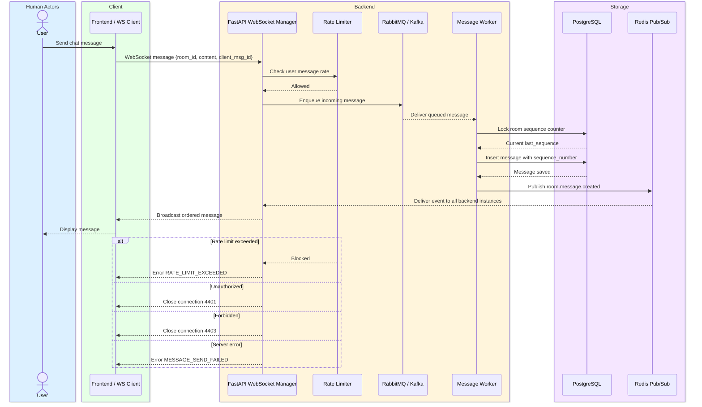
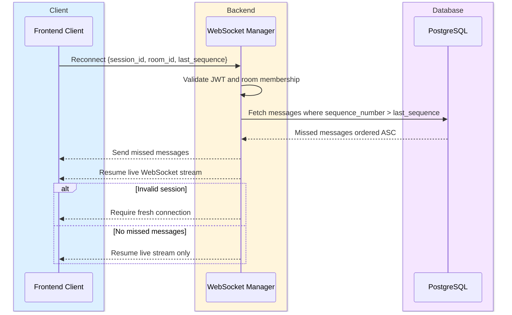
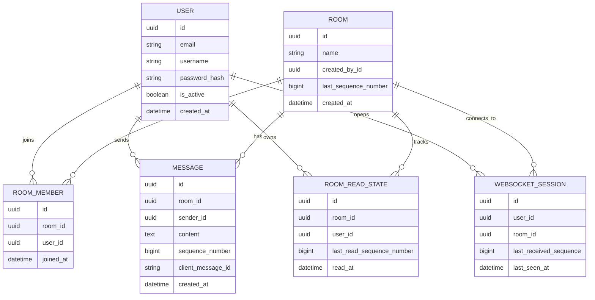
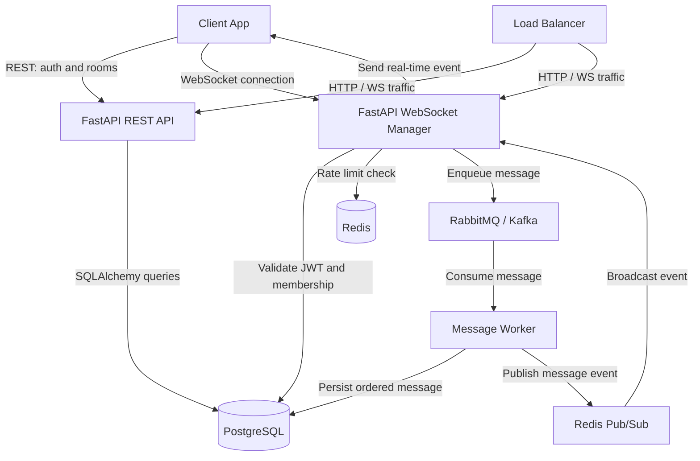

# Project Config

```txt
Project Name:      Real-Time Chat App
Project ID Prefix: CHAT
Tech Stack:
  Backend:         FastAPI
  Frontend:        React or simple HTML/JS demo client
  Database:        PostgreSQL
  Cache / PubSub:  Redis
  Message Queue:   RabbitMQ or Kafka
  ORM / Migration: SQLAlchemy + Alembic
  Containerization: Docker + Docker Compose
User Roles:        User
API Base URL:      /api/v1
```

---

# Flow 001 — User Authentication

## 1.1 Metadata

```txt
Flow Name:     User Authentication
Flow ID:       CHAT-001
Trigger:       User registers or logs in
Entry Point:   Login/Register page
Exit Point:    User receives access token and refresh token
Related Flows: CHAT-002, CHAT-003, CHAT-004
```

## 1.2 Description

This flow allows users to create accounts and log in securely. The system issues JWT access and refresh tokens after successful authentication. The access token is used for REST APIs and WebSocket connection authorization. This flow does not include password reset or email verification unless added later.

## 1.3 Actors

| Role   | Type      | Responsibilities                                     |
| ------ | --------- | ---------------------------------------------------- |
| User   | Human     | Registers, logs in, uses tokens                      |
| System | Automated | Validates credentials, hashes passwords, issues JWTs |

## 1.4 Steps

* User — submits email, username, and password.
* System — validates required fields and password strength.
  ↳ if email already exists: return duplicate email error.
* System — hashes password and stores user.
* User — logs in with email and password.
* System — verifies credentials.
  ↳ if invalid: return authentication error.
* System — returns access token and refresh token.

## 1.5 Validations

### Input Validations

| Field    | Rule                          | Error Message                                        |
| -------- | ----------------------------- | ---------------------------------------------------- |
| email    | required, valid email, unique | “Please enter a valid unique email.”                 |
| username | required, 3–50 chars, unique  | “Username must be unique and at least 3 characters.” |
| password | required, minimum 8 chars     | “Password must be at least 8 characters.”            |

### Business Rules

| Rule           | Condition                        | Behavior            |
| -------------- | -------------------------------- | ------------------- |
| Unique account | Email or username already exists | Reject registration |
| Valid login    | Password does not match          | Return 401          |

### Security Validations

| Check            | Details                         |
| ---------------- | ------------------------------- |
| Authentication   | Not required for register/login |
| Token / Session  | JWT access + refresh tokens     |
| Password storage | Store only hashed passwords     |

### Error Handling

| Scenario            | System Response        |
| ------------------- | ---------------------- |
| Invalid credentials | 401 Unauthorized       |
| Duplicate email     | 409 Conflict           |
| Server error        | 500 with retry message |

---

# Flow 002 — Create, List, and Join Rooms

## 1.1 Metadata

```txt
Flow Name:     Room Management
Flow ID:       CHAT-002
Trigger:       Authenticated user creates, lists, or joins a room
Entry Point:   Rooms page
Exit Point:    User is a member of selected room
Related Flows: CHAT-003
```

## 1.2 Description

This flow lets authenticated users create named rooms, view existing rooms, and join rooms. Rooms group users and messages together. Only room members can send messages, receive messages, typing events, and read receipts inside that room.

## 1.3 Actors

| Role   | Type      | Responsibilities                    |
| ------ | --------- | ----------------------------------- |
| User   | Human     | Creates, lists, joins rooms         |
| System | Automated | Validates room rules and membership |

## 1.4 Steps

* User — opens the rooms page.
* System — returns list of available rooms.
  ↳ if no rooms exist: return empty list.
* User — creates a room with a name.
* System — validates name uniqueness.
  ↳ if duplicate: return conflict error.
* System — creates room and adds creator as member.
* User — joins an existing room.
* System — checks if user is already a member.
  ↳ if already joined: return existing membership response.

## 1.5 Validations

### Input Validations

| Field | Rule                          | Error Message                                         |
| ----- | ----------------------------- | ----------------------------------------------------- |
| name  | required, 3–100 chars, unique | “Room name must be unique and at least 3 characters.” |

### Business Rules

| Rule             | Condition           | Behavior                   |
| ---------------- | ------------------- | -------------------------- |
| Unique room name | Name already exists | Return 409 Conflict        |
| Membership       | User already joined | Return existing membership |

### Security Validations

| Check             | Details                |
| ----------------- | ---------------------- |
| Authentication    | Required               |
| Role-based access | Any authenticated user |
| Token / Session   | Valid JWT access token |

---

# Flow 003 — Real-Time Messaging

## 1.1 Metadata

```txt
Flow Name:     Send Real-Time Message
Flow ID:       CHAT-003
Trigger:       User sends a message over WebSocket
Entry Point:   Active WebSocket room connection
Exit Point:    Message is persisted and delivered in order to all room members
Related Flows: CHAT-004, CHAT-005, CHAT-006
```

## 1.2 Description

This flow handles real-time chat messages. A user sends a message over WebSocket, the backend validates it, pushes it into a message queue, persists it in PostgreSQL, assigns a room-level sequence number, then broadcasts it through Redis Pub/Sub. This guarantees ordering and allows multiple FastAPI instances to synchronize messages.

## 1.3 Actors

| Role              | Type      | Responsibilities                        |
| ----------------- | --------- | --------------------------------------- |
| User              | Human     | Sends and receives messages             |
| WebSocket Manager | Automated | Manages connections and subscriptions   |
| Message Worker    | Automated | Processes queued messages               |
| Redis Pub/Sub     | Automated | Syncs messages across backend instances |
| PostgreSQL        | Automated | Stores messages permanently             |

## 1.4 Steps

* User — connects to WebSocket with JWT, room ID, session ID, and last received sequence number.
* System — validates token and room membership.
  ↳ if invalid token: close WebSocket with unauthorized error.
  ↳ if not room member: close WebSocket with forbidden error.
* User — sends message payload.
* System — applies rate limit.
  ↳ if exceeded: return rate-limit error.
* System — pushes message into RabbitMQ/Kafka queue.
* Worker — consumes message from queue.
* Worker — creates next sequence number for the room.
* Worker — saves message in PostgreSQL.
* Worker — publishes message event to Redis Pub/Sub.
* Every backend instance — receives Redis event.
* WebSocket Manager — broadcasts message to connected users in that room.
* Client — stores latest received sequence number.

## 2.1 Sequence Diagram



## 2.2 Message Ordering Design

Use a **room-level sequence number**.

Each room has:

```txt
last_sequence_number
```

When a worker processes a message:

1. Lock the room row or sequence table.
2. Increment `last_sequence_number`.
3. Save message with that sequence.
4. Publish only after DB commit.
5. Clients order messages by `sequence_number`.

This guarantees:

```txt
Room A:
message 1 -> sequence 1
message 2 -> sequence 2
message 3 -> sequence 3
```

Even if multiple backend instances receive messages at the same time, the database lock prevents two messages from getting the same sequence.

---

# Flow 004 — Reconnection and Missed Messages

## 1.1 Metadata

```txt
Flow Name:     WebSocket Reconnection
Flow ID:       CHAT-004
Trigger:       Client reconnects after network failure
Entry Point:   Client has old session ID and last received sequence number
Exit Point:    Client receives missed messages without duplicates
Related Flows: CHAT-003
```

## 1.2 Description

This flow allows clients to reconnect safely after losing WebSocket connection. The client sends its session ID and last received sequence number. The backend queries missed messages from PostgreSQL and sends only messages with a higher sequence number.

## Steps

* Client — reconnects with `room_id`, `session_id`, and `last_received_sequence`.
* System — validates JWT and room membership.
* System — queries missed messages:

```sql
SELECT *
FROM messages
WHERE room_id = :room_id
AND sequence_number > :last_received_sequence
ORDER BY sequence_number ASC;
```

* System — sends missed messages first.
* System — resumes live Redis Pub/Sub events.
* Client — ignores duplicate messages using `message_id` or `sequence_number`.

## Sequence Diagram



---

# Flow 005 — Typing Indicators

## 1.1 Metadata

```txt
Flow Name:     Typing Indicator
Flow ID:       CHAT-005
Trigger:       User starts or stops typing
Entry Point:   Active WebSocket room connection
Exit Point:    Other room members see typing state
Related Flows: CHAT-003
```

## Description

Typing indicators are temporary real-time events. They are not persisted in PostgreSQL. They are broadcast through Redis Pub/Sub so users connected to different backend instances still receive the event.

## Steps

* User — starts typing.
* Client — sends WebSocket event `typing.started`.
* Backend — validates user is in room.
* Backend — publishes typing event to Redis.
* All backend instances — broadcast typing event to room subscribers.
* Client — hides typing indicator after timeout or `typing.stopped`.

---

# Flow 006 — Read Receipts

## 1.1 Metadata

```txt
Flow Name:     Read Receipts
Flow ID:       CHAT-006
Trigger:       User views messages in a room
Entry Point:   Active chat room
Exit Point:    Messages are marked as read for that user
Related Flows: CHAT-003
```

## Description

Read receipts track which user has read which message. The client sends the highest read sequence number. The backend stores a per-user per-room read state instead of inserting one row per message whenever possible.

## Recommended Design

Use:

```txt
room_read_states
- room_id
- user_id
- last_read_sequence_number
- read_at
```

This is more efficient than saving every message read individually.

## Steps

* Client — sends `read.receipt` with `room_id` and `last_read_sequence_number`.
* Backend — validates membership.
* Backend — updates user’s room read state.
* Backend — publishes read receipt event through Redis.
* Other clients — update read UI.

---

# Data Models

## Model: User

| Field         | Type     | Required | Default | Notes                    |
| ------------- | -------- | -------- | ------- | ------------------------ |
| id            | UUID     | Auto     | uuid4   | Primary key              |
| email         | String   | Yes      | —       | Unique, indexed          |
| username      | String   | Yes      | —       | Unique, indexed          |
| password_hash | String   | Yes      | —       | Never store raw password |
| is_active     | Boolean  | Yes      | true    | Account status           |
| created_at    | DateTime | Auto     | now     | Indexed                  |
| updated_at    | DateTime | Auto     | now     | —                        |

## Model: Room

| Field                | Type         | Required | Default | Notes                          |
| -------------------- | ------------ | -------- | ------- | ------------------------------ |
| id                   | UUID         | Auto     | uuid4   | Primary key                    |
| name                 | String       | Yes      | —       | Unique, indexed                |
| created_by_id        | UUID FK User | Yes      | —       | `on_delete=SET_NULL` preferred |
| last_sequence_number | BigInt       | Yes      | 0       | Used for message ordering      |
| created_at           | DateTime     | Auto     | now     | Indexed                        |

## Model: RoomMember

| Field     | Type         | Required | Default | Notes               |
| --------- | ------------ | -------- | ------- | ------------------- |
| id        | UUID         | Auto     | uuid4   | Primary key         |
| room_id   | UUID FK Room | Yes      | —       | `on_delete=CASCADE` |
| user_id   | UUID FK User | Yes      | —       | `on_delete=CASCADE` |
| joined_at | DateTime     | Auto     | now     | —                   |

Constraint:

```txt
UNIQUE(room_id, user_id)
```

## Model: Message

| Field             | Type         | Required | Default | Notes                        |
| ----------------- | ------------ | -------- | ------- | ---------------------------- |
| id                | UUID         | Auto     | uuid4   | Primary key                  |
| room_id           | UUID FK Room | Yes      | —       | `on_delete=CASCADE`, indexed |
| sender_id         | UUID FK User | Yes      | —       | `on_delete=CASCADE`, indexed |
| content           | Text         | Yes      | —       | Message body                 |
| sequence_number   | BigInt       | Yes      | —       | Unique per room              |
| client_message_id | String       | Yes      | —       | Prevent duplicate sends      |
| created_at        | DateTime     | Auto     | now     | Indexed                      |

Constraints:

```txt
UNIQUE(room_id, sequence_number)
UNIQUE(sender_id, client_message_id)
```

## Model: RoomReadState

| Field                     | Type         | Required | Default | Notes               |
| ------------------------- | ------------ | -------- | ------- | ------------------- |
| id                        | UUID         | Auto     | uuid4   | Primary key         |
| room_id                   | UUID FK Room | Yes      | —       | `on_delete=CASCADE` |
| user_id                   | UUID FK User | Yes      | —       | `on_delete=CASCADE` |
| last_read_sequence_number | BigInt       | Yes      | 0       | Latest message read |
| read_at                   | DateTime     | Auto     | now     | Updated on receipt  |

Constraint:

```txt
UNIQUE(room_id, user_id)
```

## Model: WebSocketSession

| Field                  | Type         | Required | Default | Notes               |
| ---------------------- | ------------ | -------- | ------- | ------------------- |
| id                     | UUID         | Auto     | uuid4   | Session ID          |
| user_id                | UUID FK User | Yes      | —       | `on_delete=CASCADE` |
| room_id                | UUID FK Room | Yes      | —       | `on_delete=CASCADE` |
| last_seen_at           | DateTime     | Auto     | now     | Used for presence   |
| last_received_sequence | BigInt       | No       | 0       | Used for reconnect  |

---

# ER Diagram



---

# API Endpoints

| Method | Endpoint                             | Auth | Request                   | Response | Description                    |
| ------ | ------------------------------------ | ---- | ------------------------- | -------- | ------------------------------ |
| POST   | `/api/v1/auth/register`              | No   | email, username, password | 201      | Create user                    |
| POST   | `/api/v1/auth/login`                 | No   | email, password           | 200      | Return access + refresh tokens |
| POST   | `/api/v1/auth/refresh`               | Yes  | refresh_token             | 200      | Return new access token        |
| POST   | `/api/v1/rooms`                      | Yes  | name                      | 201      | Create room                    |
| GET    | `/api/v1/rooms`                      | Yes  | —                         | 200      | List rooms                     |
| POST   | `/api/v1/rooms/{room_id}/join`       | Yes  | —                         | 200      | Join room                      |
| GET    | `/api/v1/rooms/{room_id}/messages`   | Yes  | cursor / limit            | 200      | Paginated message history      |
| PATCH  | `/api/v1/rooms/{room_id}/read-state` | Yes  | last_read_sequence_number | 200      | Update read receipt            |

---

# WebSocket Protocol

## Connect

```txt
ws://localhost:8000/ws/rooms/{room_id}?token=ACCESS_TOKEN&session_id=SESSION_ID&last_sequence=15
```

## Client Events

### Send Message

```json
{
  "type": "message.send",
  "client_message_id": "uuid-from-client",
  "content": "Hello"
}
```

### Typing Started

```json
{
  "type": "typing.started"
}
```

### Typing Stopped

```json
{
  "type": "typing.stopped"
}
```

### Read Receipt

```json
{
  "type": "read.receipt",
  "last_read_sequence_number": 22
}
```

## Server Events

### Message Created

```json
{
  "type": "message.created",
  "message_id": "uuid",
  "room_id": "uuid",
  "sender_id": "uuid",
  "content": "Hello",
  "sequence_number": 23,
  "created_at": "2026-04-24T10:30:00Z"
}
```

### Rate Limit Error

```json
{
  "type": "error",
  "code": "RATE_LIMIT_EXCEEDED",
  "message": "You can send up to 10 messages per second."
}
```

---

# Main Architecture



---

# Backend Structure

```txt
app/
  main.py
  core/
    config.py
    security.py
    redis.py
    queue.py
  api/
    routes/
      auth.py
      rooms.py
      messages.py
  websocket/
    manager.py
    handlers.py
    schemas.py
  services/
    auth_service.py
    room_service.py
    message_service.py
    receipt_service.py
  repositories/
    user_repository.py
    room_repository.py
    message_repository.py
  models/
    user.py
    room.py
    message.py
    read_state.py
    websocket_session.py
  workers/
    message_worker.py
  db/
    session.py
    base.py
  alembic/
```

---

# Docker Compose Services

Required services:

```txt
fastapi-1
fastapi-2
postgres
redis
rabbitmq
nginx / load balancer
```

Health checks:

```txt
PostgreSQL: pg_isready
Redis: redis-cli ping
FastAPI: GET /health
RabbitMQ: rabbitmq-diagnostics ping
```

---

# Key Production Rules

| Requirement        | Design Decision                                               |
| ------------------ | ------------------------------------------------------------- |
| Message ordering   | Room-level `sequence_number` generated inside DB transaction  |
| Reconnection       | Client sends `last_sequence`; backend returns missed messages |
| No duplicates      | Use `client_message_id` + `sender_id` unique constraint       |
| Rate limiting      | Redis counter per user, e.g. `rate:user:{id}`                 |
| Horizontal scaling | Redis Pub/Sub broadcasts between backend instances            |
| Persistence        | PostgreSQL stores all messages                                |
| Queue decoupling   | RabbitMQ/Kafka receives incoming messages before processing   |
| WebSocket state    | Kept in memory per instance, synchronized using Redis Pub/Sub |

---

# Developer Notes

## Backend Developer

* Use FastAPI routers for REST endpoints.
* Use FastAPI WebSocket routes for real-time communication.
* Use SQLAlchemy async engine if possible.
* Use Alembic for migrations.
* Use Redis for:

  * rate limiting
  * Pub/Sub
  * optional presence tracking
* Use RabbitMQ/Kafka for queued message processing.
* Use PostgreSQL transaction locking when incrementing room sequence numbers.
* Add indexes on:

  * `messages(room_id, sequence_number)`
  * `room_members(room_id, user_id)`
  * `room_read_states(room_id, user_id)`

## Frontend Developer

* Store access token and refresh token securely.
* Keep `last_received_sequence_number` per room.
* On reconnect, send `session_id` and `last_sequence`.
* Deduplicate messages by `message_id` or `sequence_number`.
* Show states for:

  * connecting
  * connected
  * reconnecting
  * offline
  * rate limited
* Use optimistic UI carefully; mark messages as pending until confirmed by server.

## Mobile Developer

* Same WebSocket protocol as web.
* Store session ID and last sequence locally.
* Reconnect automatically after network failure.
* Queue unsent messages locally if offline.
* Avoid duplicate display using `client_message_id`.

## AI / ML Engineer

```txt
N/A for this flow.
```

---

# Final Recommended Build Order

```txt
1. Auth with JWT
2. Room CRUD and join system
3. Basic WebSocket connection
4. Message persistence
5. Room-level sequence ordering
6. Redis Pub/Sub cross-instance broadcast
7. Reconnection with missed messages
8. Rate limiting
9. Read receipts
10. Typing indicators
11. Docker Compose with health checks
12. README and WebSocket demo client
```
